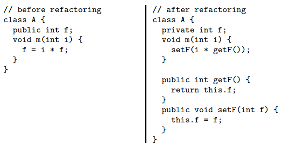
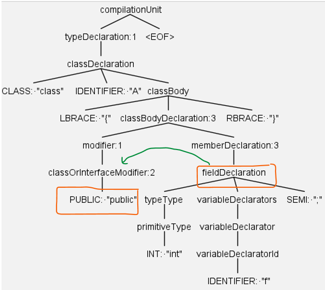
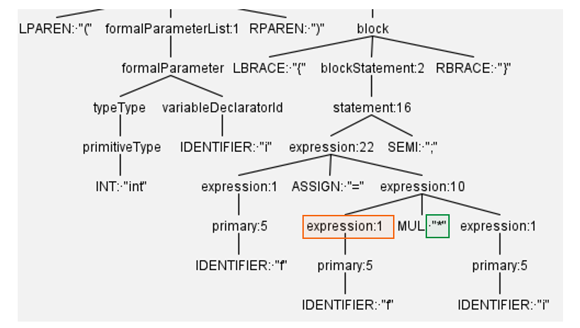

Title: Automated refactoring of the Java code using ANTLR in Python
Date: 2022-05-2 00:30
Tags: blog, ANTLR, compiler, tutorial
Author: Morteza
Summary: Refactoring is a type of program transformation that preserves the program’s behavior. The goal of refactoring is to improve the program’s internal structure without changing its external behavior. In this way, the program quality, defined and measured in terms of quality attributes, is improved. The refactoring process could be automated to reduce the required time and cost and increase the reliability of applied transformation. In this tutorial, I give a short description of how we can automate the refactoring process with ANTLR in Python. 


Refactoring is a type of program transformation that preserves the program’s behavior. The goal of refactoring is to improve the program’s internal structure without changing its external behavior. In this way, the program quality, defined and measured in terms of quality attributes, is improved. Researchers have recently studied the improvement of different quality attributes through refactoring (Mkaouer et al. 2016; Mohan and Greer 2019).


The refactoring process could be automated to reduce the required time and cost and increase the reliability of applied transformation. Refactoring engines are tools that automate the application of refactorings: first, the user chooses a refactoring to apply, then the engine checks if the transformation is safe and, if so, transforms the program. Refactoring engines are a key component of modern Integrated Development Environments (IDEs), and programmers rely on them to perform refactorings. The programmer need only select which refactoring to apply, and the engine will automatically check the preconditions and apply the transformations across the entire program if the preconditions are satisfied. Refactoring is gaining popularity, as evidenced by the inclusion of refactoring engines in modern IDEs such as IntelliJ IDEA, Eclipse, or NetBeans  for Java.

According to Fowler (Fowler and Beck 2018), the biggest change to refactoring in the last decade is the availability of tools that support automated refactoring. Refactoring engines must be reliable. A fault in a refactoring engine can silently introduce bugs in the refactored program and lead to challenging debugging sessions. If the original program compiles, but the refactored program does not, the refactoring is obviously incorrect and can be easily undone. However, if the refactoring engine erroneously produces a refactored program that compiles but does not preserve the semantics of the original program, this can have severe consequences. Therefore, an automated refactoring tool must operate on the code’s syntax tree, not the text, to perform refactoring correctly. Manipulating the syntax tree is more reliable for preserving the program syntax, semantics, and behavior. For this reason, developing an automated refactoring tool requires deep knowledge of compiler techniques. Fowler (Fowler and Beck 2018) present a catalog of more than 70 refactoring in his book and state that 

> implementing decent refactoring is a challenging programming exercise—one that I am not mostly unaware of as I gaily use the tools.
> 
> _Martin Fowler_

## ANTLR Background
Before reading this tutorial, I recommend looking at [ANTLR basic tutorial](antlr_basics.md) where I describe the background of using ANTLR to generate and walk phase three and implement custom program analysis applications with the help of the ANTLR listener mechanism. 
The most important point is that we used the real-world programming languages grammars to show the parsing and analyzing process. The discussed approach forms the underlying concepts of our approach for automated refactoring. Indeed, we implement appropriate listeners that can perform the actions required to apply each refactoring. ANTLR provides `TokenStreamRewriter` class which can manipulate program tokens at specific indices in the program. 


## Using ANTLR for automating refactoring
The _key_ to using ANTLR for refactoring tasks is the `TokenStreamRewriter` class that knows how to give altered views of a token stream without actually modifying the stream. It treats all of manipulation methods as “instructions” and queues them up for lazy execution when traversing the token stream to render it back as text. The rewriter _executes_ those instructions every time we call the `getText()` method. This strategy is very effective for the general problem of source code instrumentation or refactoring. The `TokenStreamRewriter` is a powerful and extremely efficient means of manipulating a token stream.

In the remaining sections of this post, I discuss different refactoring techniques and describe the automation of most important refactoring operation in Python based on the ANTLR library.

Please note that the full implementation of the automation of any refactoring operations contains many details that are too complicated to describe here. Therefore, I only focused on the most important part of the automation process in this chapter. For the interested readers, the full implementation of discussed refactoring can be found on [https://github.com/m-zakeri/CodART](https://github.com/m-zakeri/CodART). 

CodART  is our recently developed open-source refactoring engine that has automated the application of 16 refactoring operations with ANTLR. The up-to-date documentation of CodART is available on [https://m-zakeri.github.io/CodART/](https://github.com/m-zakeri/CodART).
Each refactoring operation has a definition and is clearly specified by the entities in which it is involved and the role of each. I ask you to look at [CodART's white]((https://github.com/m-zakeri/CodART)) paper to find a decent introduction to refactoring operation.


## Encapsulate field
We begin with a simple yet important refactoring, encapsulate field, which provides information hiding as one of the basic principles of the object-oriented design (Booch et al. 2008). The encapsulate field refactoring replaces all references to a field with accesses through setter and getter methods. This refactoring takes as input the name of the field to encapsulate and the names of its enclosing class. It performs the following transformations:

* Creates a public getter method that returns the field’s value, 
* Creates a public setter method that updates the field’s value to a given parameter’s value,
* Replaces all field reads with calls to the getter method,
* Replaces all field writes with calls to the setter method,
* Changes the field’s access modifier to private.

Figure 1 shows an example of encapsulate field refactoring for field f in class A. 



*Figure 1: Example EncapsulateField refactoring*


To perform this refactoring automatically, we develop a listener class, `EncapsulateFiledRefactoringListener`, that implements the aforementioned transformations. The constructor of this class is shown in the following. The class takes an instance of `CommonTokenStream` class, source class name, and field identifier as input. The first parameter is used to initialize an instance of `TokenStreamRewriter` class which provides a set of methods to manipulate the syntax (parse) tree. The second and third parameters specify the entity to be refactored. 

```Python

_version_ == '0.1.0'
_author_ == 'Morteza Zakeri'

class EncapsulateFiledRefactoringListener(JavaParserLabeledListener):
    """
    To implement the encapsulate field refactoring
    make a public field private and provide 
    accessors and mutator methods.
    """

    def __init__(self, common_token_stream: CommonTokenStream = None,
                 source_class_name: str = None,
                 field_identifier: str = None):
        """
        :param common_token_stream: contains the program tokens
        :param source_class_name: contains the enclosing class of the field
        :param field_identifier: the field name to be encapsulated 
        """
        self.token_stream = common_token_stream
        self.source_class_name = source_class_name
        self.field_identifier = field_identifier
        self.in_source_class = False

        # Move all the tokens in the source code in a buffer,
	    # token_stream_rewriter.
        if common_token_stream is not None:
            self.token_stream_rewriter = \
                TokenStreamRewriter(common_token_stream)
        else:
            raise TypeError('common_token_stream is None')
```

The entire refactoring application is performed in four steps: First, we should check whether the parse tree walker is visiting the class that contains the given field or not. We use a `flag` variable `in_source_class` to indicate that the walker is entered into the source class. This flag is set to `true` when `enterClassDeclaration` method is called and is set back to `false` when `exitClassDeclaration` method is called:


```Python

def enterClassDeclaration(self, ctx: JavaParserLabeled.ClassDeclarationContext):
    if ctx.IDENTIFIER().getText() == self.source_class_name:
        self.in_source_class = True

def exitClassDeclaration(self, ctx: JavaParserLabeled.ClassDeclarationContext):
    self.in_source_class = False

```


The second step is to change the access modifier of the field from public to private. We could perform this either when entering or exiting from the `fieldDeclartion` rule in the Java grammar. It is required to ensure that we modify the given field, not other files in the class or program. The first and second `if` statements in the following code perform this check. Afterward, the `replaceRange` method of the `token_stream_rewriter` is called to replace the “public” modifier token with the “private” modifier token, shown in the following code snippet. 

```Python
def enterFieldDeclaration(self, ctx: JavaParserLabeled.FieldDeclarationContext):
    if self.in_source_class:
        if ctx.variableDeclarators().variableDeclarator(
                0).variableDeclaratorId().getText() == self.field_identifier:
            if ctx.parentCtx.parentCtx.modifier(0).getText() == 'public':
                self.token_stream_rewriter.replaceRange(
                  from_idx=ctx.parentCtx.parentCtx.modifier(0).start.tokenIndex,
                  to_idx=ctx.parentCtx.parentCtx.modifier(0).stop.tokenIndex,
                  text='private')
            else:
                return
```


Figure 2 shows the part of the parse tree generated for the code snippet in Figure 1. The parse tree visualization help understand the logic behind the implementation of the `enterFieldDeclaration` method in the above code. Indeed, we write a fragment of code by observing the position of nodes in the corresponding parse tree. For example, when we enter the `fieldDeclartion` rule (i.e., when ANTLR calls the above method), the ANTLR runtime library provides a ctx object of class `FieldDeclarationContext`, which contains pointers `FieldDeclaration` to parent and children. These pointers allow us to move between the different nodes in the parse tree, typically around our main node, which is `FieldDeclaration` in our example. 



*Figure 2: Part of the parse tree generated for the code is snipped in Figure 1 (left).*


Our goal is to change the “public” token to “private,” which is the direct child of the `classOrInterfaceModifier` node and the descendant of the modifier node. Therefore, we should access from `FieldDeclaration` node to one of the modifier or `classOrInterfaceModifier` nodes. The statement `ctx.parentCtx.parentCtx.modifier(0)` give us to the first child of the modifier node, i.e., `classOrInterfaceModifier`. The green arrow in Figure 2 shows how we can move from `FieldDeclaration` node to the `classOrInterfaceModifier` node.

In the third step, we add the getter and setter methods for the encapsulated field to the class body. To this aim, we define the `new_code` variable that holds the generated codes. The code can be generated based on a simple _template_ that accessor and mutator methods typically follow. When the generated code is completed, it is added to the class body after the encapsulated field declaration using the `insertAfter` method of the `token_stream_rewriter` object. We use the `exitFieldDeclaration` method to put the described actions. The following code snippet shows generating and inserting accessor and mutator methods.

```Python
def exitFieldDeclaration(self, ctx: JavaParserLabeled.FieldDeclarationContext):
    if self.in_source_class:
        if ctx.variableDeclarators().variableDeclarator(
                0).variableDeclaratorId().getText() == self.field_identifier:
   # Check if getter or setter methods already exist
   for c in ctx.parentCtx.parentCtx.parentCtx.classBodyDeclaration():
         if c.memberDeclaration().methodDeclaration().IDENTIFIER() \
                .getText() == 'get' + str.capitalize(
            self.field_identifier):
            self.getter_exist = True

        if c.memberDeclaration().methodDeclaration().IDENTIFIER() \
                .getText() == 'set' + str.capitalize(
            self.field_identifier):
            self.setter_exist = True

  # Generate accessor and mutator methods if not exist
  # Accessor body
  new_code = ''
  if not self.getter_exist:
      new_code = '\n\t// new getter method\n\t'
      new_code += 'public ' + ctx.typeType().getText() + \
                ' get' + str.capitalize(self.field_identifier)
      new_code += '() { \n\t\treturn this.' + self.field_identifier 
             + ';' + '\n\t}\n'

  # Mutator body
  if not self.setter_exist:
      new_code += '\n\t// new setter method\n\t'
      new_code += 'public void set' + \
                str.capitalize(self.field_identifier)
      new_code += '(' + ctx.typeType().getText() + ' ' \
                + self.field_identifier + ') { \n\t\t'
      new_code += 'this.' + self.field_identifier + ' = ' \
                + self.field_identifier + ';' + '\n\t}\n'
  self.token_stream_rewriter.insertAfter(ctx.stop.tokenIndex, new_code)

```

The above code checks that getter and setter do not already exist. Thereafter, a new getter and setter method is added to the class body.
The fourth step is to update the references of the encapsulated field to replace the field usages with the appropriate setter or getter method. There are different rules in the grammar that describe access to the class fields. A complete encapsulate field refactoring should be considered all rules. However, the code for updating the field usages with getter and setter methods is almost the same. For example, by looking at Figure 3, which is part of the code shown in Figure 1, we can find that when the right-hand side brother of node `experssion1` is a binary operator such as MUL, the child of `expression1` must be replaced with the getter method. 



_Figure 3: Part of the parse tree generated for the code is snipped in Figure 1 (left)_

The following code snipped performs this transformation when the walker exit from the `expression1` node.

```Python
def exitExpression1(self, ctx: JavaParserLabeled.Expression1Context):
    if self.in_source_class and self.in_selected_package:
        try:
            if ctx.parentCtx.getChild(1).getText() in 
                     ('=', '+=', '-=', '*=', '/=', '&=','|=', '^=', '>>=',
                     '>>>=', '<<=', '%=') and ctx.parentCtx.getChild(0) == ctx:
                return
        except:
            pass
        if ctx.getText() == 'this.' + self.field_identifier:
            new_code = 'this.get' + str.capitalize(self.field_identifier) + '()'
            self.token_stream_rewriter.replaceRange(ctx.start.tokenIndex,
                                                    ctx.stop.tokenIndex,
                                                    new_code)
```

Other places where the encapsulated field is accessed or modified should be found and updated in a similar way described in this step. Once all fourth steps described in this section are applied, the code snippet shown in Figure 1 (left) is transformed to the code snippet shown in Figure 1 (right), and the encapsulated refactoring is completed.


## Conclusion and remarks
Most of the techniques described in this section can be used to automate other refactoring operations. The only different things are the required actions, which are often unique to each refactoring. The overall process consists of looking at the relevant parts of the parse tree, choosing a relevant node, and implementing the required actions.

The `ctx` object of the `Context` class contains all information we need to find and check or change when performing the refactoring. In addition, visualization of the parse tree helps choose which node can be chosen for which actions and how the actions should be programmed. 

It should be noted that selecting a pares tree node (or grammar rule) to put the required actions does not have a unique and deterministic answer. In other words, we can put our actions in a set of nodes when programming with ANTLR. For example, to change the “public” token to a “private” token, one may put the required actions in the `memberDeclartion` node, which sightly changes our above code. The right node should be chosen that minimizes the implementation effort of that actions. As general advice, when automating refactoring operations, we write our actions on the node near the refactoring entities.

I try to explain the automation of more refactoring operation to this tutorial. 

Stay hungry, stay incomplete :)

---

## References

Booch G, Maksimchuk RA, Engle MW, et al (2008) Object-oriented analysis and design with applications, third edition. ACM SIGSOFT Softw Eng Notes 33:29–29. https://doi.org/10.1145/1402521.1413138

Fowler M, Beck K (2018) Refactoring: improving the design of existing code, Second Edi. Addison-Wesley


