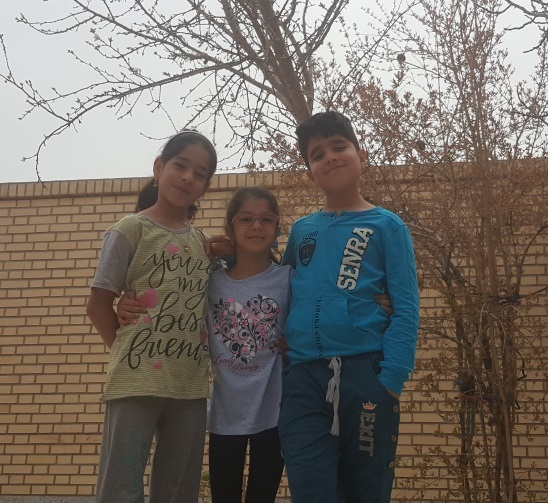

Title: Children and Programming 
Date: 2019-02-22 21:30
Tags: blog
Author: Morteza
Summary: An introduction to Scratch programming tool for children

I love teaching programming/codding to children. I strongly believe that the 21st century is the century of **CODE**. But where should we start? What can we do for our 21st century kids?
There are many ways to teach programming to a kid. I have begun with [Scratch](https://scratch.mit.edu){:target="_blank"} programming tool. In this blog post, I am going to describe some important features of [Scratch](https://scratch.mit.edu){:target="_blank"}.

