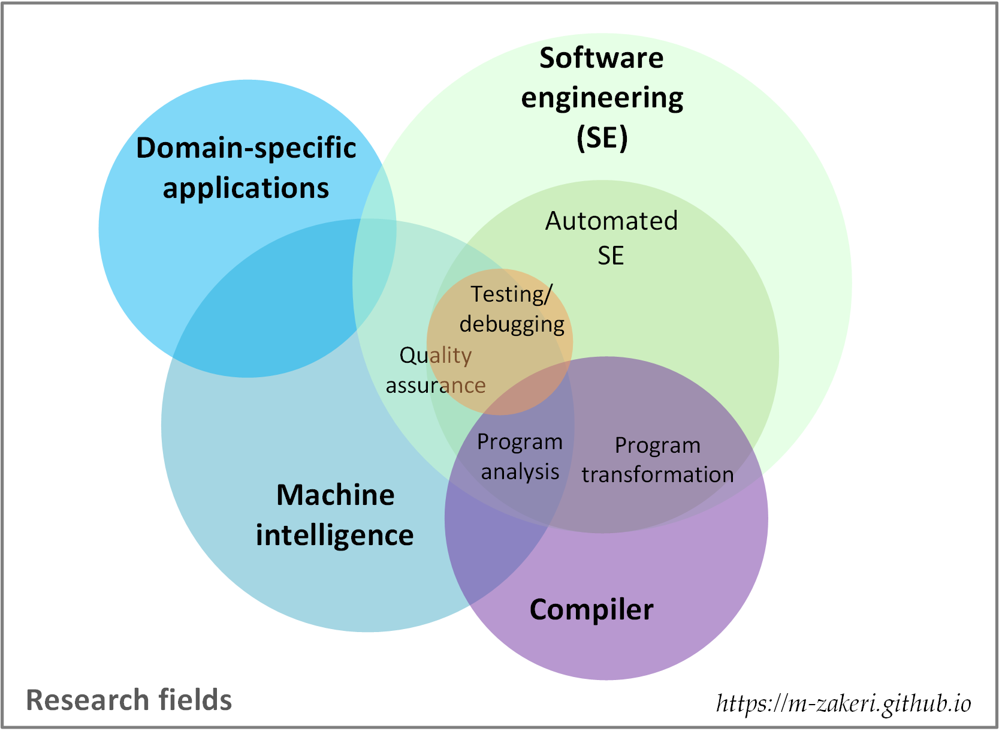

Title: Research
Author: Morteza
Date: 2022-09-12 12:00
Modified: 2022-09-16 16:30

 

 

I enjoy domain-independent problem-solving from Computer Science (CS) perspective. I like devising new thinking paradigms, problem-solving methods, and systems for complexity engineering. Complex real-life problems could be simplified and solved through various thinking paradigms: systematic thinking, abstract thinking, computational thinking, data thinking, network thinking, and eventually, what I call, reverse computational thinking.

## Overview 
My areas of research are depicted as a venn diagram in the following figure.

Briefly, my research and consulting areas are as follows:

* Automated software engineering (code generation, testing, and debugging)
* Software refactoring, re-engineering, and reverse engineering
* Compilers, program analysis, and transformation
* Machine learning and natural language processing applications in software engineering
* Machine learning applications in biomedical engineering
* Machine learning applications in sociology (computational sociology)

## Research statement
> Towards better software systems by automating laborious tasks in software engineering through the intelligent reverse engineering techniques

My research interests are about empirical and automated software engineering (EASE), focused on [refactoring](https://m-zakeri.github.io/CodART), [testing](https://github.com/m-zakeri/benchmark), [test data generation](https://m-zakeri.github.io/iust_deep_fuzz), static analysis, and applying machine learning in software engineering.

Software engineering is intricate because software systems and ecosystems are inherently complex, intangible, and unpredictable.
Software engineers must deal with non-trivial activities such as testing, quality assurance, and maintenance during the software development life cycle (SDLC). Efficient automation of these activities not only increases processes quality but also leads to economic savings. 

Unfortunately, search-based software engineering (SBSE) techniques fail to automate emerging tasks such as measuring and improving software quality in practice.
I use machine learning software engineering (MLSE) besides SBSE to address open problems in automating SDLC activities, including refactoring, testing, debugging, repair, and maintenance. 

During my M.Sc., I applied deep learning to learn the complex files formats grammar and then built a generative model to [generate new test data for file format fuzzer](https://m-zakeri.github.io/iust_deep_fuzz). 
For the time being, as part of my Ph.D. thesis, I have focused on [measuring and improving the testability of software systems artifacts](https://m-zakeri.github.io/PhD). 
For more information please refer to [my research statement](../static/pdf/morteza_zakeri_rs.pdf){:target="_blank"}.
Also, I have described some backgrounds used in my research in my [blog](https://m-zakeri.github.io/category/blog.html){:target="_blank"}.

## Research projects

### DeepFuzz
DeepFuzz is a fuzzing framework based on the deep neural languages to fuzz software with complex inputs. This project belongs to my master thesis in software engineering: "Automatic test data generation in file format fuzzers". DeepFuzz automatically generates new, valid, and various complex structure files, mainly PDF files, as test data to use in dynamic testing of real-world applications, e.g., PDF readers.
[Read more](https://www.researchgate.net/project/IUST-Deep-Fuzz){:target="_blank"}.

### Software testability prediction
Connecting runtime information to the static properties of the program is a key point in measuring software quality, specifically testability. Despite a large number of researches on software testability, we observed that the relationship between testability and test adequacy criteria had not been studied, and testability metrics still are far from measuring the actual testing effort. We hypothesize that testability has a significant impact on automatic testing tools. Therefore, we propose a new methodology to measure and quantify software testability by exploiting both runtime information and static properties of the source code.
[Read more](https://www.researchgate.net/project/Testability-prediction){:target="_blank"}.

### Healthcare with IoT
Healthcare with IoT is a field that explores the use of internet-connected devices and networks to provide, monitor, and improve patient care and health services.
IoT-based healthcare has shown potential benefits such as improved patient safety, reduced healthcare costs, enhanced accessibility of healthcare services, and increased operational efficiency in the healthcare industry.
This project aims to explore the applications of Internet of Things (IoT) in healthcare. 
[Read more](https://www.researchgate.net/project/Healthcare-with-IoT){:target="_blank"}.

### QualCode
QualCode is an online platform to measure and rank software systems quality based on [ISO/IEC 25010](https://iso25000.com/index.php/en/iso-25000-standards/iso-25010).
The quality model is the cornerstone of a product quality evaluation system. The quality model determines which quality characteristics will be taken into account when evaluating the properties of a software product.

### CodART
CodART is an open-source software toolkit for refactoring Java source codes.
Software refactoring is performed by changing the software structure without modifying its external behavior. Many software quality attributes can be enhanced through the source code refactoring, such as reusability, flexibility, understandability, and testability. Refactoring engines are tools that automate the application of refactorings: first, the user chooses a refactoring to apply, then the engine checks if the transformation is safe, and if so, transforms the program. Refactoring engines are a key component of modern Integrated Development Environments (IDEs), and programmers rely on them to perform refactorings.
[Read more](https://m-zakeri.github.io/CodART/){:target="_blank"}.

