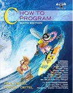
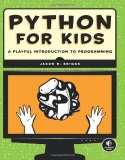
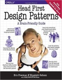

Title: Resources
Author: Morteza

Some related and useful links in programming and software engineering

##Research and technical reports
* [ A Survey of sequence-to-sequence learning with neural networks ](http://www.boute.ir/iust-nlp-96/290){:target="_blank"} (in Persian) Fall 2017
* [An introduction to NoSQL databases](http://micropedia.ir/1397/02/13/introduction-to-nosql-databases/){:target="_blank"} (in Persian)

## Have a programming question? Join us-:)
* [Micropedia code group on the telegram](http://micropedia.ir/){:target="_blank"}
* [Micropedia programming tutorials (Persian)](http://micropedia.ir/tutorials/){:target="_blank"} (in Persian)
* [Micropedia code repository](http://micropedia.ir/category/code/){:target="_blank"} 

## Recommended programming resources

A road map to learning programming/codding

| Row |                                                                        Photo                                           |     Resource name                                                                                                                                          |               Additional links                         |
|:---:|:----------------------------------------------------------------------------------------------------------------------:|:----------------------------------------------------------------------------------------------------------------------------------------------------------:|:------------------------------------------------------:|
|  1  |                    | [Micropedia essential course on C and C++ (for beginners)](http://micropedia.ir/category/cpp-essential-course/){:target="_blank"}                          | www.micropedia.ir                                      |
|  2  |                                                    | [C How to Program (Book by Harvey Deitel and Paul Deitel)](http://www.deitel.com/Books/C/CHowtoProgram7e/tabid/3635/Default.aspx){:target="_blank"}        | www.deitel.com                                         |
|  3  |                                                | [C++ How to Program (Book by Harvey Deitel and Paul Deitel)](http://www.deitel.com/Books/C/CHowtoProgram9e/tabid/3644/Default.aspx){:target="_blank"}      | www.deitel.com                                         |
|  4  |                                              | [JAVA How to Program (Book by Harvey Deitel and Paul  Deitel)](http://deitel.com/Books/Java/JavaHowtoProgram11e/tabid/3683/Default.aspx){:target="_blank"} | www.deitel.com                                         |

## Recommended programming resources for children
| Row |                             Photo                             	|         Resource name                                             	|                Additional links                   |
|:---:|:---------------------------------------------------------------:|:---------------------------------------------------------------------:|:-------------------------------------------------:|
|  1  |                  | [Scratch (MIT Media Lab)](https://scratch.mit.edu/){:target="_blank"} 	|  www.scratch.mit.edu	                            |
|     |          | [Python for Kids: A Playful Introduction to Programming](https://books.google.com/books/about/Python_for_Kids.html?id=Wd_PJ2y68uIC&printsec=frontcover&source=kp_read_button#v=onepage&q&f=false){:target="_blank"}     |     |
|  2  | | Python Cookbook                           	                                        |                                                   |
|  3  |                                                                 |                                                                      	|                                                   |

## Advanced software engineering resources

| Row |                                                                        Photo                                           |     Resource name                                                                                                                                          |               Additional links                         |
|:---:|:----------------------------------------------------------------------------------------------------------------------:|:----------------------------------------------------------------------------------------------------------------------------------------------------------:|:------------------------------------------------------:|
|  1  |                                                      | An introduction to Algorithms                                                                                                                              |                                                        |
|  2  |                               | Object oriented design and analysis                                                                                                                                                          |                                                        |
|  3  |                              | Design patterns                                                                                                                                                           |                                                        |

## Other useful links
* [My GitHub projects](https://github.com/m-zakeri/){:target="_blank"} [New]
* [My GitHub projects](https://github.com/mortazazakeri){:target="_blank"} [Old]
* [My gist (code snip)](https://gist.github.com/m-zakeri){:target="_blank"}
* [My old blog](http://zakerim.webs.com/){:target="_blank"}
* [My LinkedIn profile](https://www.linkedin.com/in/mortazazakeri/){:target="_blank"}
* [My SlideShare profile](https://www.slideshare.net/MortezaZakeri){:target="_blank"}
* [Other resources and materials](https://www.slideshare.net/MortezaZakeri){:target="_blank"}

